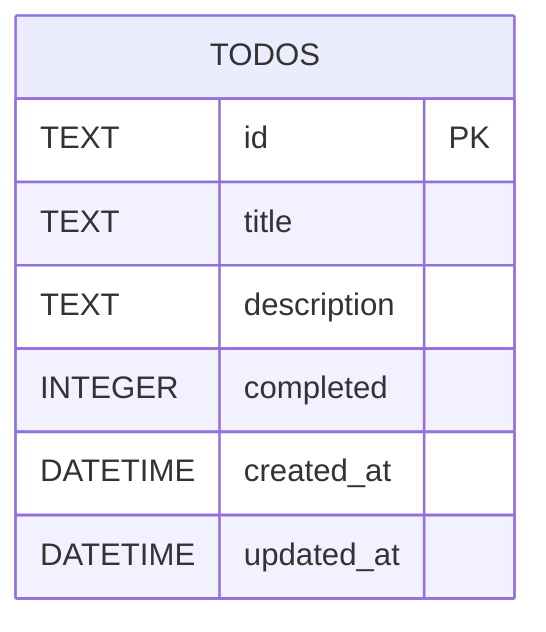
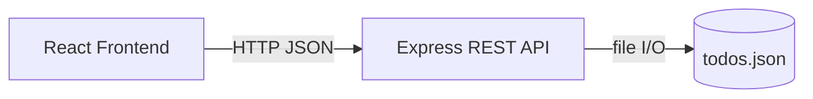
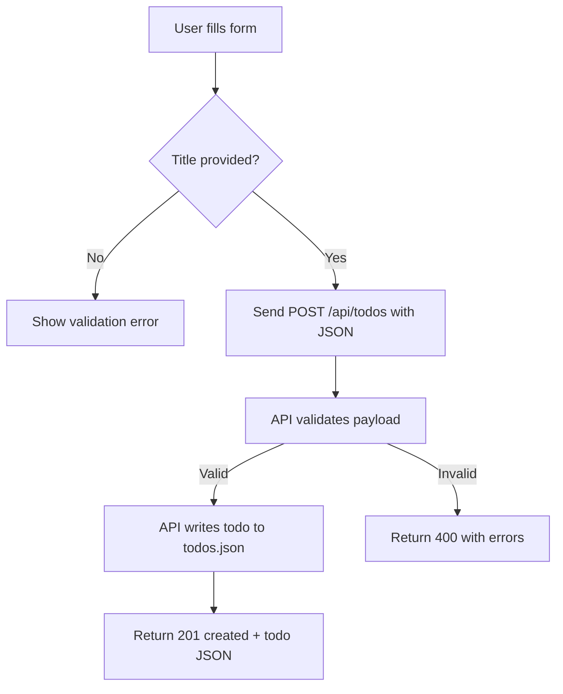
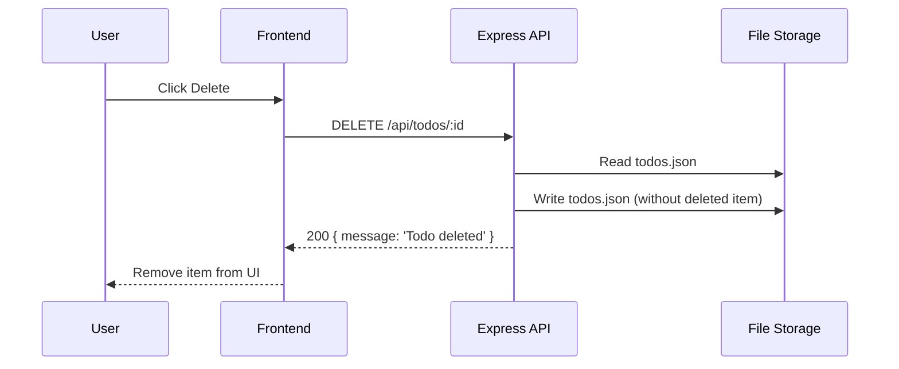

# EasyPlug — Part B: System Analysis, Database Design, SQL and Diagrams

This document answers Part B of the EasyPlug assessment. It includes system analysis, database design, required SQL statements, and diagrams (Mermaid).

---

## 1. System Analysis Questions

### 1.1 Main users
- Admin: manages the system, can view all todos and (optionally) clear or export data.
- User: creates, updates, completes, deletes, and lists personal or team todos.

> Note: For this small app we assume a single-user/shared-team mode (no authentication). If authentication is added, users would be associated with todos.

### 1.2 Functional requirements (at least five)
1. Display a list of todo items.
2. Create a new todo item with a title (required) and optional description.
3. Edit an existing todo item (title, description, completed status).
4. Mark a todo as completed/uncompleted.
5. Delete a todo item.
6. Return appropriate HTTP responses and validation errors for each API operation.

### 1.3 Non-functional requirements (examples)
- Performance: API responds within 200ms for simple in-memory/JSON storage under light load.
- Reliability: Data persistence (JSON file) survives server restarts; atomic writes to avoid corruption.
- Usability: Clear validation messages, empty-state UI, and mobile-responsive layout.

### 1.4 Assumptions
- Single workspace without user authentication unless added later.
- Simple JSON file storage (`backend/todos.json`) is acceptable for the assessment.
- IDs are UUID strings generated by the backend.

### 1.5 Main business rules
- Every todo must have a non-empty title.
- `completed` is a boolean; toggling flips its state.
- Titles are not required to be unique but should be short and descriptive.

### 1.6 Behavior on submitting an empty title
- Frontend: prevent submission and show validation error "Please enter a title." (client-side validation).
- Backend: return HTTP 400 with validation error message from Yup: `{ message: 'Validation failed', errors: [...] }`.

### 1.7 Frontend-backend communication
- Protocol: HTTP/HTTPS using JSON payloads.
- Frontend uses `axios` to send requests to the REST API endpoints (`/api/todos`).
- For create/update: JSON body contains `title`, `description`, `completed` fields.
- API returns JSON bodies and appropriate HTTP status codes (200/201/400/404).

### 1.8 Possible errors and handling
- Validation error (400): return field-specific messages; UI shows messages near form.
- Not found (404): when a requested todo id does not exist; UI should show an error toast.
- File write/read error (500): log server error and return 500; frontend shows a general error message.

---

## 2. Database Design Questions

### 2.1 Table design for storing todo items
We use one table `todos` with the following columns:
- `id` (string/UUID) — primary key
- `title` (string) — required
- `description` (string) — optional
- `completed` (boolean) — required, default `false`
- `created_at` (datetime) — default to current timestamp
- `updated_at` (datetime) — nullable, set on updates

### 2.2 Primary key
- `id` is the primary key. UUIDs ensure uniqueness across distributed clients and are simple for tests.

### 2.3 Data types rationale
- `id`: TEXT/UUID — portable across SQLite/Postgres/MySQL
- `title`, `description`: TEXT/VARCHAR — textual content
- `completed`: BOOLEAN / INTEGER (0/1 in SQLite) — indicates completion
- `created_at`, `updated_at`: DATETIME/TIMESTAMP — track creation and modification times

### 2.4 Required vs optional fields
- Required: `id`, `title`, `completed` (default false)
- Optional: `description`, `updated_at`

### 2.5 Why `completed` stored as boolean
- Boolean provides a clear semantic for completed state and makes querying (WHERE completed = true) straightforward. Databases optimize boolean checks.

### 2.6 Database constraints to protect data quality
- `PRIMARY KEY (id)`
- `title` NOT NULL and length limit if necessary (e.g., VARCHAR(255))
- `completed` NOT NULL DEFAULT false
- CHECK constraint to ensure `completed` is 0/1 in SQLite or boolean in other DBs
- Unique constraint (optional) on a combination like (`id`) — primary key already enforces uniqueness

### 2.7 Handling system users changes
- If users are added, create a `users` table and add `user_id` foreign key to `todos` (nullable for legacy data).
- Migrate existing todos by assigning ownership or leaving `user_id` null for shared todos.

### 2.8 Normalization
- The design is normalized (1NF/2NF) — each todo row stores atomic values. If we add users or tags, those would be separate tables with foreign keys (3NF).

---

## 3. Required Database Table Design

| Column Name | Data Type | Required | Constraint | Description |
|---|---:|:---:|---|---|
| id | TEXT / UUID | Yes | PRIMARY KEY | Unique identifier for the todo item |
| title | TEXT | Yes | NOT NULL | Short task title |
| description | TEXT | No |  | Optional task details |
| completed | BOOLEAN / INTEGER | Yes | NOT NULL DEFAULT false | Indicates whether the task is completed |
| created_at | DATETIME | No | DEFAULT CURRENT_TIMESTAMP | Date/time when the task was created |
| updated_at | DATETIME | No |  | Date/time when the task was last updated |

---

## 4. SQL Questions — Example statements (SQLite/Postgres compatible where possible)

1) Create the todo table

```sql
CREATE TABLE IF NOT EXISTS todos (
  id TEXT PRIMARY KEY,
  title TEXT NOT NULL,
  description TEXT,
  completed INTEGER NOT NULL DEFAULT 0,
  created_at DATETIME DEFAULT CURRENT_TIMESTAMP,
  updated_at DATETIME
);
```

2) Insert a new todo item

```sql
INSERT INTO todos (id, title, description, completed)
VALUES ('550e8400-e29b-41d4-a716-446655440000', 'Buy groceries', 'Milk, eggs, bread', 0);
```

3) Select all todo items

```sql
SELECT * FROM todos ORDER BY created_at DESC;
```

4) Select only completed todo items

```sql
SELECT * FROM todos WHERE completed = 1 ORDER BY updated_at DESC;
```

5) Select a todo item by id

```sql
SELECT * FROM todos WHERE id = '550e8400-e29b-41d4-a716-446655440000';
```

6) Update the title or description of a todo by id

```sql
UPDATE todos
SET title = 'Buy groceries and snacks',
    description = 'Milk, eggs, bread, chips',
    updated_at = CURRENT_TIMESTAMP
WHERE id = '550e8400-e29b-41d4-a716-446655440000';
```

7) Mark a todo item as completed by id

```sql
UPDATE todos
SET completed = 1,
    updated_at = CURRENT_TIMESTAMP
WHERE id = '550e8400-e29b-41d4-a716-446655440000';
```

8) Delete a todo item by id

```sql
DELETE FROM todos WHERE id = '550e8400-e29b-41d4-a716-446655440000';
```

9) Count how many todo items are completed and how many are incomplete

```sql
SELECT
  SUM(CASE WHEN completed = 1 THEN 1 ELSE 0 END) AS completed_count,
  SUM(CASE WHEN completed = 0 THEN 1 ELSE 0 END) AS incomplete_count
FROM todos;
```

10) Search for todo items where the title contains a specific keyword (case-insensitive)

```sql
-- SQLite
SELECT * FROM todos WHERE lower(title) LIKE '%' || lower('grocer') || '%' ORDER BY created_at DESC;

-- Postgres
SELECT * FROM todos WHERE title ILIKE '%' || 'grocer' || '%' ORDER BY created_at DESC;
```

11) Explain the difference between DELETE, UPDATE, and SELECT

- `SELECT`: retrieves rows from the database without modifying data.
- `UPDATE`: modifies existing rows (changes values) while keeping them in the table.
- `DELETE`: removes rows from the table entirely.

---

## 5. Diagram Questions

Below are textual explanations and Mermaid diagrams for requested diagrams.

### 5.1 Use case diagram (user interactions)

```mermaid
%%{init: {"theme":"base","themeVariables":{"primaryColor":"#2563eb","edgeLabelBackground":"#ffffff"}}}%%
usecaseDiagram
  actor User
  User --> (Create Todo)
  User --> (Edit Todo)
  User --> (Mark Complete)
  User --> (Delete Todo)
  User --> (View Todos)
```

**Explanation:** The `User` interacts with the typical todo operations: create, edit, complete, delete, and view.

### 5.2 Entity Relationship Diagram (ERD)



**Explanation:** Single `TODOS` entity. If a `USERS` table is added, it would be linked via a foreign key `user_id`.

### 5.3 Simple system architecture diagram



**Explanation:** The React frontend sends HTTP requests to the Express API. The API reads/writes `todos.json` for persistence.

### 5.4 Flowchart for adding a new todo



### 5.5 Sequence diagram for delete request and response



### 5.6 Brief explanations
- **Use case diagram:** shows actors and actions (create, edit, delete, view, mark complete).
- **ERD:** shows single-table structure; normalized design.
- **Architecture:** React frontend ↔ Express API ↔ JSON file storage.
- **Flowchart:** validation, API call, persistence, response flow for create.
- **Sequence:** request-response order for delete operation.

---

## Deliverables
- This markdown file contains the Part B answers and diagrams.
- If you prefer diagrams as image files, I can export SVG/PNG versions from the Mermaid code and add them to the repository.

## Screenshots for diagrams
For the assessment, include screenshots of the diagramming tool you used for each diagram below.
Copy the screenshot images into your submission document under the relevant question.

Suggested screenshot items:
1. Use case diagram tool screenshot
2. ERD diagram tool screenshot
3. System architecture diagram tool screenshot
4. Flowchart diagram tool screenshot
5. Sequence diagram tool screenshot

Example insertion:

### 5.1 Use case diagram (user interactions)


### 5.2 Entity Relationship Diagram (ERD)


Use the same pattern for the other diagrams.


---

*End of Part B answers.*
